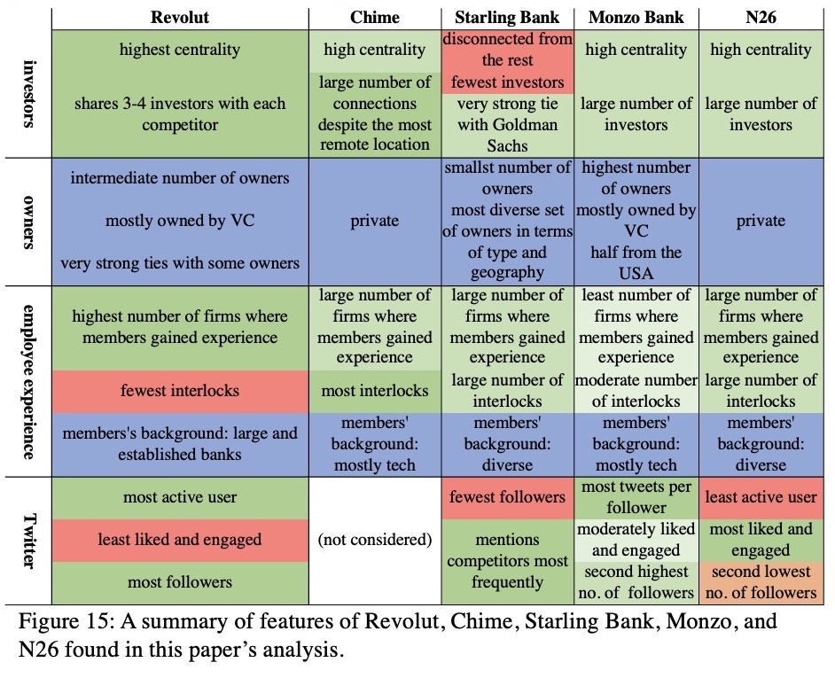

---
authors:
- admin
date: "2022-03-18T00:00:00Z"
doi: ""
featured: true
image:
  caption: 'Main Results'
  focal_point: ""
  preview_only: false

publication_types:
- "1"
publishDate: "2022-03-18T00:00:00Z"
summary: The goal of this paper is to analyze the network around Revolut, a London company that has emerged from a startup offering an inter-bank rate currency exchange to a challenger bank that is the second largest in the world and the largest in Europe by market valuation. To that end, I consider the network structures of financial, human, and social capital flows around Revolut.

tags: [Economics]
title: The Network around Revolut—How Interconnected are the Leading Digital Banks?

url_code: ""
url_dataset: ""
url_pdf: "network.pdf"
url_poster: ""
url_project: ""
url_slides: "network_slides.pdf"
url_source: ""
url_video: ""
---
This <a href="network.pdf">paper</a> finds that Revolut, Monzo, Starling Bank, N26, and Chime do not form dense networks in terms of investors, owners, or companies where their board and team members work concurrently or gained professional experience. It is very surprising that there are few connections among these digital banks. 

By construction of my analysis, digital banks are central members of the networks and hold structurally equivalent role relationships. Within these narrowly defined networks, the digital banks formed only indirect linkages through investors, and very few shared former employers of their board and team members. This situation generates a lot of structural holes in the network of digital bank startups; investors and owners form cliques, and expertise and experience do not flow between the banks in a way observable in my data. In fact, in the case of interlocks, the board and team members form cliques around their digital banks. 

Are there, then, any opportunities for arbitrage or bridging some of the companies? Considering that these startups differ in the characteristics of their capital structures, a merger between the ones with complimentary features of human capital seems a viable option to consider.

</img>

Read the full paper <a href="network.pdf">here</a>, or just see all the figures <a href="figures.pdf">here</a>. The slides from my presentation are <a href="network_slides.pdf">here</a>.