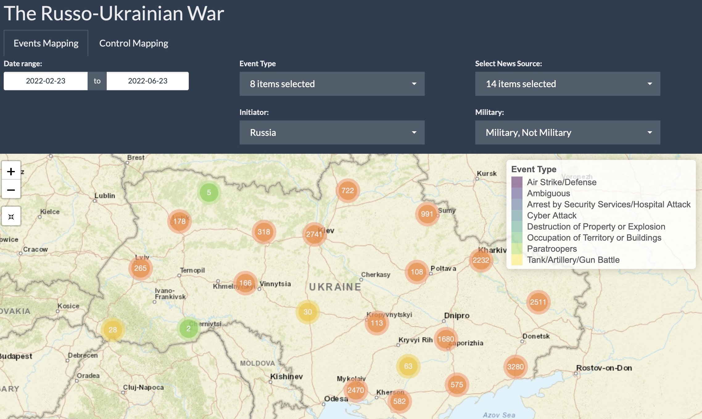
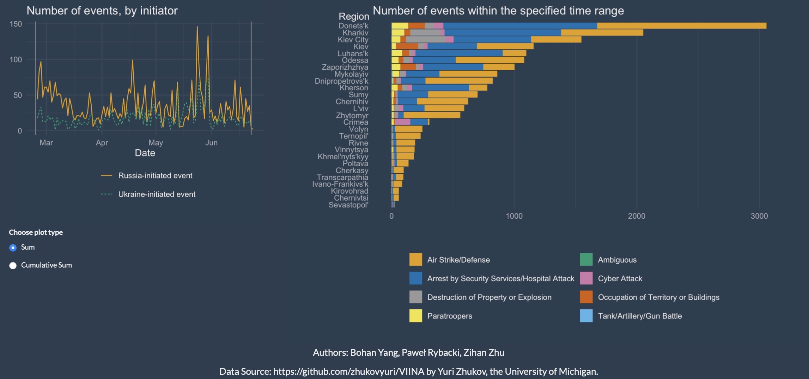

In this [project](https://github.com/dataviz-sp22/proj2-other-carp/tree/main/Write-up), Bohan, Zihan, and me have built together a Shiny [app](https://pawelrybacki.shinyapps.io/shiny_app/) with interactive plots to visualize the Russo-Ukrainian war.

The Russo-Ukrainian conflict has grown into a long-lasting war causing countless casualties nearly everyday. The earliest modern confrontation can be dated back to 2014, when pro-Russian separatists in two cities in Ukraine, Donetsk and Luhansk, started revolts. From 2014 to 2022, there were several minor military events and non-military violent events happened in Ukraine in the area close to the Russian-Ukrainian border. In 2022, allegedly concerned with the potential Eastward expansion of NATO, Russia started a war against Ukraine by attacking targets in the whole country using air weapons and by invading its land territory from multiple sides at the same time. Millions of refugees fled the country, dozens of thousands of people including civilians have been killed in targeted and untargeted attacks, many people have been tortured and robbed of their life assets, and many cities have been destroyed within several weeks. 

Our [app](https://pawelrybacki.shinyapps.io/shiny_app/) illustrates the military events happened during the 2022 Russo-Ukrainian war and keeps track of the territorial boundaries and military marches of soldiers from two sides. We use interactive plots to  demonstrate the process of the war live, including the territory movement, military and non-military events across different time-frames.

</img>
</img>

## The App:
While we recommended to run the app locally for the best user experience, we have also deployed it on the shinyapp.io server [here](https://pawelrybacki.shinyapps.io/shiny_app/).

## The Full Write-Up:
Read the description of the project [here, on my team's GitHub repository](https://github.com/dataviz-sp22/proj2-other-carp/tree/main/Write-up).

## The Code:
The code that prepares the dataset and creates an interactive data visualization app is [also on our repository](https://github.com/dataviz-sp22/proj2-other-carp/tree/main/Shiny%20App).

## The Dataset:
We use the VIINA (Violent Incident Information from News Articles on the 2022 Russian Invasion of Ukraine) [dataset](https://github.com/zhukovyuri/VIINA/tree/master/Data) collected by Professor Yuri Zhukov from the University of Michigan. It’s a near-real-time multi-source event collection based on news reports from Ukrainian and Russian media. Zhukov geocoded and classified them into standard conflict event categories through machine learning. The events are GIS-ready, with temporal precision down to the minute. This dataset is very comprehensive and provides extensive information to visualize. You can access all data files used by our app [here](https://github.com/dataviz-sp22/proj2-other-carp/tree/main/Data)

